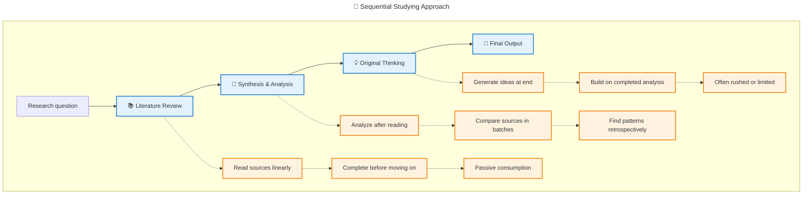

---
tags:
  - zettelkasten
  - notetaking
  - research
public: true
description: Ahrens and Eco both write about research writing, but from opposite viewpoints (top-down vs bottom-up)
---

[[How to Write a Thesis - Umberto Eco]] Vs [[How to Take Smart Notes - Sönke Ahrens]]

These two books represent fundamentally different philosophies about the research and writing process. Both are very good in their own right. 

- [ ] Compare with [[How to read a book - Doren]]

## **Eco’s Sequential Approach**

- **Start with**: Research question or thesis topic
- **Then**: Systematic [[literature review]]
- **Then**: Organize and synthesize findings
- **Here**: This would be the place to think
- **Finally**: Write the thesis
- **Philosophy**: **Top-down** - know what you’re looking for before you start

## **Ahrens’ Emergent Approach**

- **Start with**: Reading interesting sources
- **Continuously**: Take atomic notes and make connections
- **Gradually**: Let research questions emerge from note patterns
- **Finally**: Assemble insights into coherent arguments
- **Philosophy**: **Bottom-up** - let the research question find you

<svg viewBox="0 0 400 350" xmlns="http://www.w3.org/2000/svg">
  <!-- Background -->
  <rect width="400" height="350" fill="#f8f9fa"/>
  <!-- Define gradients for better visual appeal -->
  <defs>
    <linearGradient id="litGradient" x1="0%" y1="0%" x2="100%" y2="100%">
      <stop offset="0%" style="stop-color:#3b82f6;stop-opacity:0.6"/>
      <stop offset="100%" style="stop-color:#1d4ed8;stop-opacity:0.4"/>
    </linearGradient>
    <linearGradient id="synthGradient" x1="0%" y1="0%" x2="100%" y2="100%">
      <stop offset="0%" style="stop-color:#ef4444;stop-opacity:0.6"/>
      <stop offset="100%" style="stop-color:#dc2626;stop-opacity:0.4"/>
    </linearGradient>
    <linearGradient id="origGradient" x1="0%" y1="0%" x2="100%" y2="100%">
      <stop offset="0%" style="stop-color:#10b981;stop-opacity:0.6"/>
      <stop offset="100%" style="stop-color:#059669;stop-opacity:0.4"/>
    </linearGradient>
  </defs>
  <!-- Literature Review Circle (Top) -->
  <circle cx="200" cy="120" r="80" fill="url(#litGradient)" stroke="#1d4ed8" stroke-width="2"/>
  <!-- Synthesis & Analysis Circle (Bottom Left) -->
  <circle cx="150" cy="220" r="80" fill="url(#synthGradient)" stroke="#dc2626" stroke-width="2"/>
  <!-- Original Thinking Circle (Bottom Right) -->
  <circle cx="250" cy="220" r="80" fill="url(#origGradient)" stroke="#059669" stroke-width="2"/>
  <!-- Labels for each circle -->
  <text x="200" y="70" text-anchor="middle" font-family="Arial, sans-serif" font-size="12" font-weight="bold" fill="#1d4ed8">
    Literature
  </text>
  <text x="200" y="85" text-anchor="middle" font-family="Arial, sans-serif" font-size="12" font-weight="bold" fill="#1d4ed8">
    Review
  </text>
  <text x="90" y="265" text-anchor="middle" font-family="Arial, sans-serif" font-size="11" font-weight="bold" fill="#dc2626">
    Synthesis &amp;
  </text>
  <text x="90" y="280" text-anchor="middle" font-family="Arial, sans-serif" font-size="11" font-weight="bold" fill="#dc2626">
    Analysis
  </text>
  <text x="310" y="265" text-anchor="middle" font-family="Arial, sans-serif" font-size="11" font-weight="bold" fill="#059669">
    Original
  </text>
  <text x="310" y="280" text-anchor="middle" font-family="Arial, sans-serif" font-size="11" font-weight="bold" fill="#059669">
    Thinking
  </text>
  <!-- Intersection labels -->
  <!-- Literature Review ∩ Synthesis & Analysis -->
  <text x="165" y="155" text-anchor="middle" font-family="Arial, sans-serif" font-size="9" fill="#4b5563">
    Lit Review ∩
  </text>
  <text x="165" y="167" text-anchor="middle" font-family="Arial, sans-serif" font-size="9" fill="#4b5563">
    Synthesis
  </text>
  <!-- Literature Review ∩ Original Thinking -->
  <text x="235" y="155" text-anchor="middle" font-family="Arial, sans-serif" font-size="9" fill="#4b5563">
    Lit Review ∩
  </text>
  <text x="235" y="167" text-anchor="middle" font-family="Arial, sans-serif" font-size="9" fill="#4b5563">
    Original
  </text>
  <!-- Synthesis & Analysis ∩ Original Thinking -->
  <text x="200" y="250" text-anchor="middle" font-family="Arial, sans-serif" font-size="9" fill="#4b5563">
    Synthesis ∩
  </text>
  <text x="200" y="262" text-anchor="middle" font-family="Arial, sans-serif" font-size="9" fill="#4b5563">
    Original
  </text>
  <!-- Center intersection (All three) -->
  <text x="200" y="185" text-anchor="middle" font-family="Arial, sans-serif" font-size="10" font-weight="bold" fill="#1f2937">
    All Three
  </text>
  <text x="200" y="198" text-anchor="middle" font-family="Arial, sans-serif" font-size="10" font-weight="bold" fill="#1f2937">
    Overlap
  </text>
  <!-- Title -->
  <text x="200" y="25" text-anchor="middle" font-family="Arial, sans-serif" font-size="16" font-weight="bold" fill="#1f2937">
    Research Process Components
  </text>
</svg>

## **Key Philosophical Differences**

### **Research Question Origin**

- **Eco**: “Choose your topic first, then research it”
- **Ahrens**: “Research broadly, let topics emerge from connections”

### **Note-Taking Purpose**

- **Eco**: Notes serve a **predetermined research agenda**
- **Ahrens**: Notes **create the research agenda** through emergent connections
→ [[notes are simply components, stripped of external context, collected for future use]]
### **Writing Process**
- **Eco**: Writing happens **after** research is complete
- **Ahrens**: Writing happens **throughout** the research process (permanent notes are already writing)
→ [[For notes to be useful, actively engage with them]]
→ [[Notes are conversations with your future self]]
### **Serendipity Role**
- **Eco**: Acknowledges [[serendipity]] but treats it as **supplementary** to planned research
- **Ahrens**: Makes serendipity **central** to the research methodology
→ [[There is freedom in letting go of assumptions and limits. These less traveled paths will be more fulfilling and adventurous]]
## **Which Is Better?**

**Eco’s approach** works well for:

- **Structured academic programs** with clear requirements
- **Time-constrained projects** with specific deliverables
- **Confirmatory research** testing existing hypotheses

**Ahrens’ approach** excels for:

- **Exploratory research** in novel domains
- **Long-term intellectual development**
- **Interdisciplinary insights** and creative breakthroughs
- **Compound knowledge building** over years or decades

The key insight is that **Ahrens isn’t just describing a different note-taking method**—he’s describing a **fundamentally different [[epistemology]]** about how knowledge is created and discovered.​​​​​​​​​​​​​​​​