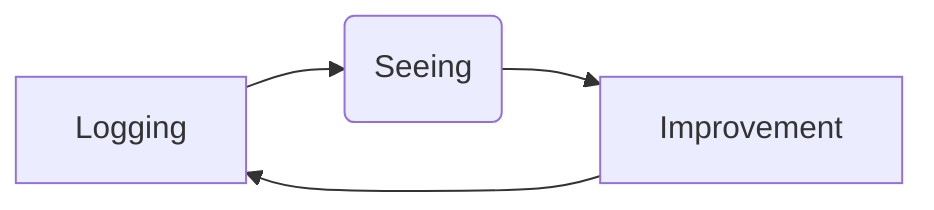

[[Zettelkasten and Evergreen MOC]]

The habit of starting _all_ writing in the [[daily note]] reduces friction and stress
	- Key understanding of a good (daily) [[pkm]]
	- It is just easy, you don't have to think where stuff goes. Journaling in itself reduces stress [[Journaling is healthy for mind and body]]
	- If I like it (and want to reuse it) I can put the information in a more permanent place
	- Play-space, solves high barrier. Prototype and just write.
	- Logging progress in the daily journal creates the possibility to see progress [[Start a new habit with something simple, there will be a bigger change of success]]
	- [[Weekly Review]]  (monthly, quarterly, etc, see [[Getting Things Done]])

For daily notes to have _lasting value_ they must be **tagged** and [[linking|linked]]
		- If not tagged, the daily note becomes a black hole where information just disappears. There is just ==too much information to be useful.== [[most information is useless or redundant. filter out everything you won't make notes about]]
		- information disappears if it is not reused again, later [[Only actively engaged and repeated information is remembered]]

Use [[spaced repetition as a productivity tool]] for ideas noted in the daily note that have no current links?
## Literature notes 
- [[How and why to tag your Daily Notes]]
- [How I Use Logseq to Take Notes and Organize My Life | by Shu Omi | Shu Omi’s Blog | Medium](https://medium.com/my-learning-journal/how-i-use-logseq-to-take-notes-and-organize-my-life-3669a75eb224)  [[spaced repetition as a productivity tool]] #bookmark [[Shu Omi]]
- [Daily working log](https://notes.andymatuschak.org/z28QkpK3vRKQTacjFDfGYBhCXHqHuVWJzny9)

